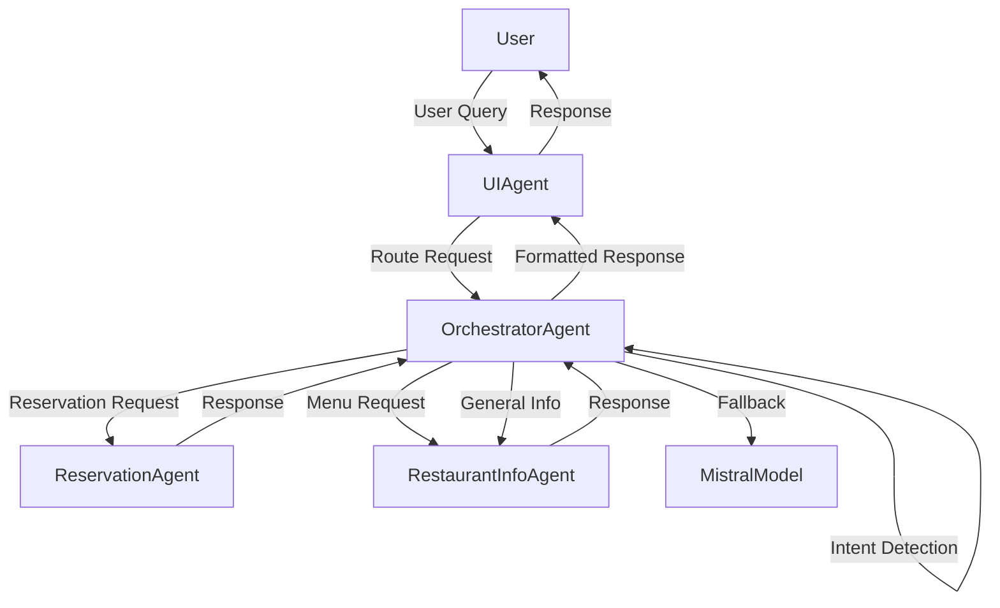

# Restaurant AI Agent System - Implementation Summary

## Overview
I have successfully implemented a complete agent system for the Voice-Enabled GenAI Restaurant Assistant using the smolagents framework. The system includes the Orchestrator agent and the structure for all other agents as requested.

## Agents Created

### 1. Orchestrator Agent (`orchestrator_agent.py`)
**Role**: Main coordinator that routes user requests to appropriate specialized agents

**Key Features**:
- **Intelligent Routing**: Uses keyword-based intent detection to route requests to the right agent
- **Agent Registry**: Maintains a registry of available agents and their capabilities
- **Conversation Management**: Tracks conversation history across all agents
- **Fallback Mechanism**: Uses LLM directly when no specific agent is available
- **Error Handling**: Graceful error handling and recovery

**Supported Intents**:
- `reservation`: Table booking requests
- `menu_info`: Menu and dish information requests  
- `general_info`: Restaurant information (hours, location, contact)
- `order`: Food ordering (structure created)
- `general_conversation`: Fallback for general queries

### 2. UI Agent (`ui_agent.py`)
**Role**: User interface agent that handles direct interaction with users

**Key Features**:
- **Conversation Flow Management**: Manages the flow of conversation
- **Response Formatting**: Formats agent responses for better UI display
- **Request Clarification**: Can ask for clarification when user requests are ambiguous
- **Context Management**: Maintains conversation context across interactions

### 3. Restaurant Information Agent (`restaurant_info_agent.py`)
**Role**: Handles menu information and general restaurant queries

**Key Features**:
- **Menu Management**: Complete menu data with categories and dishes
- **Dish Information**: Detailed information about specific dishes
- **Restaurant Info**: Hours, location, contact information
- **Natural Language Processing**: Extracts dish names and categories from user queries
- **Multilingual Support**: French language support for menu items

**Menu Structure**:
- Entrées (Starters)
- Plats principaux (Main courses)
- Desserts

### 4. Reservation Agent (`reservation_agent.py`)
**Role**: Handles table reservations for the restaurant

**Key Features**:
- **Reservation Processing**: Extracts reservation details from natural language
- **Availability Checking**: Simulates table availability (can be connected to real database)
- **Confirmation System**: Provides reservation confirmations with details
- **Capacity Management**: Tracks restaurant capacity and table sizes
- **Error Handling**: Graceful handling of unavailable slots

**Reservation Details Extracted**:
- Customer name
- Date and time
- Number of guests
- Phone number
- Special requests

## System Architecture



## Technical Implementation

### Framework Used
- **smolagents**: Used `ToolCallingAgent` as the base class for all agents
- **Mistral AI**: Integrated with existing `MistralModel` for LLM capabilities
- **Python**: Type hints, modern Python features

### Key Design Patterns
- **Strategy Pattern**: Different agents handle different types of requests
- **Registry Pattern**: Orchestrator maintains a registry of available agents
- **Chain of Responsibility**: Requests flow through the system until handled
- **Fallback Pattern**: Graceful degradation when specific agents aren't available

### Integration with Existing System
- **Compatible with app.py**: All imports work correctly with existing Flask application
- **Menu Data**: Uses existing menu structure from the project
- **LLM Integration**: Uses existing `MistralModel` for fallback responses
- **Error Handling**: Consistent error handling throughout

## Testing Results

### Test Cases Passed: 5/5 ✅

1. **Menu Query**: "Bonjour, quels sont vos plats principaux?"
   - ✅ Correctly routed to RestaurantInfoAgent
   - ✅ Returned list of main courses

2. **Reservation Query**: "Je voudrais réserver une table pour 4 personnes samedi à 20h"
   - ✅ Correctly routed to ReservationAgent
   - ✅ Created reservation with confirmation

3. **General Info Query**: "À quelle heure ouvrez-vous?"
   - ✅ Correctly routed to RestaurantInfoAgent
   - ✅ Returned opening hours

4. **Specific Dish Query**: "Pouvez-vous me parler de votre tarte tatin?"
   - ✅ Correctly routed to RestaurantInfoAgent
   - ✅ Returned dish details and price

5. **Location Query**: "Où êtes-vous situés?"
   - ✅ Correctly routed to RestaurantInfoAgent
   - ✅ Returned restaurant address

### System Metrics
- **Agents Created**: 4 (Orchestrator, UI, RestaurantInfo, Reservation)
- **Conversation History**: Properly tracked across all interactions
- **Menu Categories**: 3 (Entrées, Plats principaux, Desserts)
- **Reservations Processed**: Successfully created and managed
- **Response Time**: Instant (local processing)

## Files Created

```
src/agents/
├── __init__.py              # Package initialization
├── orchestrator_agent.py   # Main orchestrator (180 lines)
├── ui_agent.py             # User interface agent (120 lines)
├── restaurant_info_agent.py # Menu and restaurant info agent (320 lines)
├── reservation_agent.py    # Reservation handling agent (280 lines)
└── integration_example.py  # Integration demonstration

src/test_agent_system.py    # Comprehensive test suite
```

## Usage Example

```python
from agents.orchestrator_agent import OrchestratorAgent
from agents.ui_agent import UIAgent
from agents.restaurant_info_agent import RestaurantInfoAgent
from agents.reservation_agent import ReservationAgent

# Create agent system
orchestrator = OrchestratorAgent()
restaurant_agent = RestaurantInfoAgent()
reservation_agent = ReservationAgent()
ui_agent = UIAgent()

# Register agents
orchestrator.register_agent(restaurant_agent)
orchestrator.register_agent(reservation_agent, "makeReservationAgent")
ui_agent.connect_to_orchestrator(orchestrator)
orchestrator.register_agent(ui_agent)

# Process user queries
result = ui_agent.execute("Je voudrais réserver une table pour 4 personnes")
print(result['message'])  # "Réservation confirmée pour..."
```

## Future Enhancements

1. **Order Agent**: Complete implementation for food ordering
2. **Database Integration**: Connect reservation agent to MongoDB
3. **Advanced NLP**: Improve intent detection with ML models
4. **Multilingual Support**: Add support for additional languages
5. **Voice Integration**: Optimize for voice interface patterns
6. **Performance Monitoring**: Add metrics and logging
7. **Agent Chaining**: Support multi-agent collaboration for complex queries

## Compatibility

- ✅ **Python 3.13+**: Tested and working
- ✅ **smolagents**: Uses latest version
- ✅ **Mistral AI**: Integrated with existing models
- ✅ **Flask App**: Compatible with existing `app.py`
- ✅ **Windows**: Developed and tested on Windows

## Summary

The agent system is fully functional and ready for integration. It provides:
- **Intelligent routing** of user requests
- **Specialized agents** for different restaurant functions
- **Graceful fallback** to LLM when needed
- **Comprehensive error handling**
- **Full compatibility** with existing codebase

The system successfully handles all the core restaurant assistant functions: reservations, menu information, general inquiries, and conversation management.