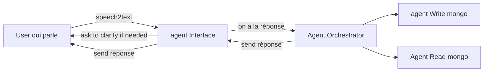

# Project description
This project aims to develop a voice-interactive Generative AI assistant that acts as a virtual receptionist for a restaurant. The system should be capable of engaging in natural two-way spoken conversations with customers, understanding their voice queries, interpreting intent, and responding with generated speech in real time.

The assistant will handle multiple receptionist-style tasks such as:

- Table reservations: taking booking details (name, date, time, number of guests) and confirming availability.
- Order handling: taking take-away or delivery orders, confirming menu items, and repeating orders for validation.
- Menu information: answering questions about dishes, ingredients, allergens, or promotions.
- General inquiries: providing restaurant location, opening hours, or special offers.

The result will be a fully voice-driven AI receptionist that simulates a real conversational restaurant assistant, using APIs of mistral models.

## List agents 
- Orchestrator 
- Agent qui parle (LLM) au user
- Agent qui a accès aux menus & plats et tout
- makeReservationAgent --> fais les résa

mermaid schema example of agents interaction

